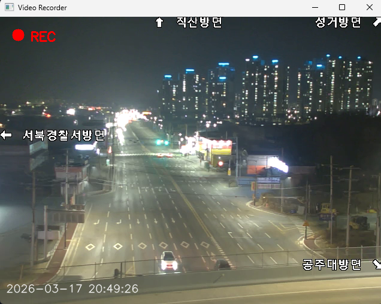
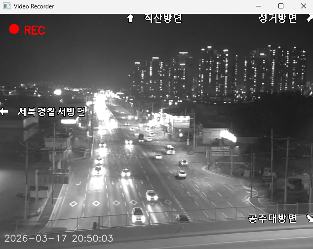
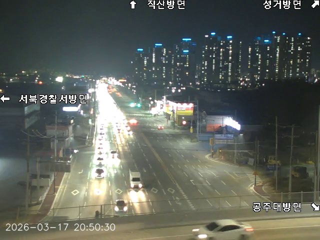

# Screenshot-Video-Recorder

## 주요 기능

**비디오 녹화** : 'Space' 키를 이용해 간편하게 녹화 시작/중지

**흑백 필터** : 'G' 키를 눌러 흑백 모드와 컬러 모드 전환 가능

**마우스 스냅샷(Screenshot)** : 화면 위 마우스 왼쪽 클릭 시 현재 프레임을 이미지로 저장

**타임 스탬프** : 영상 하단에 현재 날짜와 시간이 실시간으로 표시

## 실행 화면

|실시간 녹화 및 타임스태프 | 흑백 필터 적용 화면|
| :---: | :---: |
|  |  |
|*녹화 중에는 좌상단에 REC 표시가 나타남.* | *실시간으로 흑백 모드 전환 가능*|
|  |  |
| |*녹화 중 또는 녹화하기 전에 화면 위 마우스 왼쪽 클릭시 현재 프레임을 이미지로 저장*|
